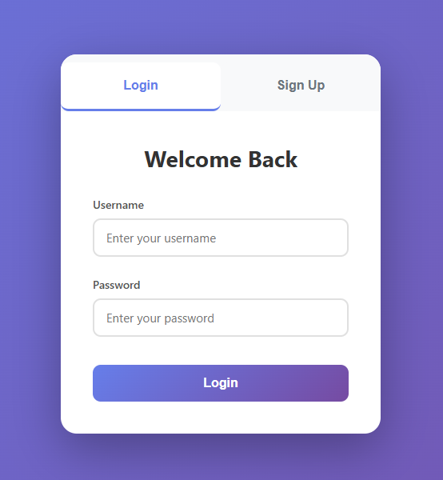
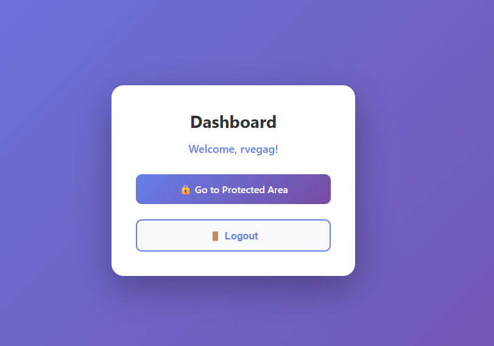
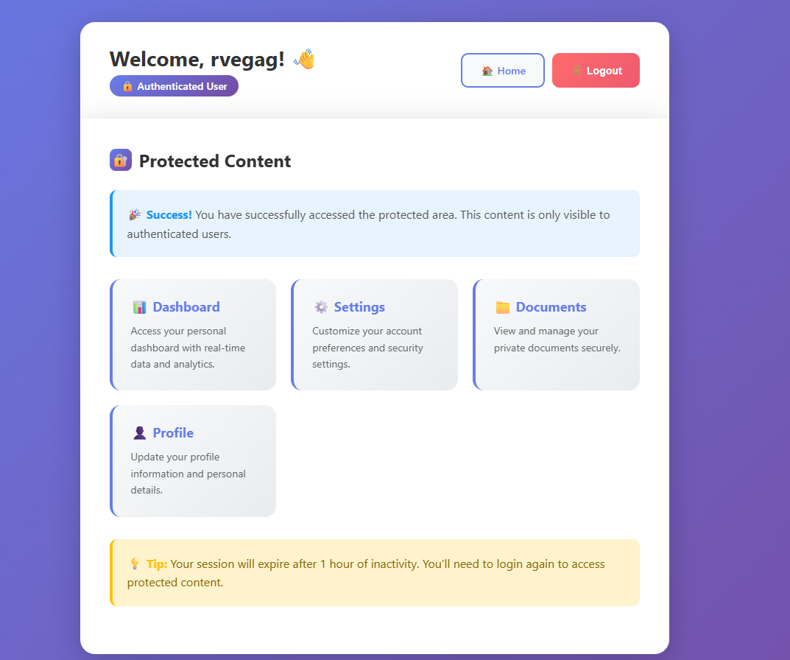

# js-user-auth

A small but complete authentication project built with **Node.js + Express** that uses **JWT** (JSON Web Tokens) stored in an **HTTP-only cookie** for authentication.

It includes:
- A REST API for register/login/logout
- A protected route guarded by JWT verification middleware
- Server-rendered views (EJS)
- A repository layer that stores users in a lightweight local JSON database (`db-local`)
- Jest + Supertest tests (ESM)

## Screenshots

| Screenshot 1 | Screenshot 2 | Screenshot 3 |
| --- | --- | --- |
|  |  |  |

## Quick start

### 1) Install

```bash
npm install
```

### 2) Create a `.env`

Create a `.env` file in the project root.

Required:
- `JWT_SECRET`

Optional:
- `PORT` (defaults to `3000`)
- `SALT_ROUNDS` (defaults to `10`)
- `NODE_ENV` (when `production`, enables secure cookies)

Example:

```env
PORT=3000
JWT_SECRET=change_me
SALT_ROUNDS=10
NODE_ENV=development
```

### 3) Run

```bash
npm run dev
```

Or:

```bash
npm start
```

## Project structure

```text
.
├── db/
│   └── User.json
├── imgs/
│   └── (screenshots)
├── test/
│   ├── api.test.js
│   └── user-repository.test.js
├── views/
│   ├── index.ejs
│   └── protected.ejs
├── config.js
├── index.js
├── user-repository.js
├── jest.config.js
├── package.json
└── README.md
```

## Authentication design

### Token transport: HTTP-only cookie

After a successful login, the server sets a cookie named `access_token`.

Cookie properties:
- `httpOnly: true` (JS on the page cannot read it)
- `sameSite: 'strict'`
- `secure: config.isProduction` (only sent over HTTPS in production)
- `maxAge: 3600000` (1 hour)

### JWT payload and expiration

On login, the server signs a JWT with a payload:

```json
{ "id": "<userId>", "username": "<username>" }
```

Token expiration:
- `expiresIn: '1h'`

### Middleware

#### `authenticateToken` (route guard)

Used by `GET /protected`.

Behavior:
- Reads `req.cookies.access_token`
- If missing: responds with `401 { error: 'No token provided' }`
- Verifies the JWT using `JWT_SECRET`
- If verification fails: responds with `403 { error: 'Invalid or expired token' }`
- If valid: attaches decoded payload to `req.user` and calls `next()`

#### Session-like middleware (for views)

A second middleware runs for every request:
- Initializes `req.session = { user: null }`
- If a valid token exists, sets `req.session.user` to the decoded JWT payload

This enables the home page (`GET /`) to render differently depending on whether the user is logged in.

## API

All endpoints accept/return JSON (except the view routes).

### POST `/register`

Creates a new user.

Request:
```json
{ "username": "newuser", "password": "password123" }
```

Responses:
- `201 { "userId": "<id>" }`
- `400 { "error": "Username and password are required" }` if missing fields
- `400 { "error": "<validation message>" }` for validation errors (examples below)

### POST `/login`

Authenticates a user and issues a JWT.

Request:
```json
{ "username": "newuser", "password": "password123" }
```

Responses:
- `200` with:
  - `Set-Cookie: access_token=<jwt>; HttpOnly; ...`
  - Body: `{ user, token }`
- `400 { "error": "Username and password are required" }` if missing fields
- `401 { "error": "<message>" }` if credentials are invalid

### POST `/logout`

Clears the authentication cookie.

Response:
- `200 { "message": "Logout successful" }`

### GET `/`

Renders the home page view (`index.ejs`) with the optional `user` from `req.session`.

### GET `/protected`

Protected page:
- Requires a valid `access_token` cookie
- Renders `protected.ejs` with `user: req.user` (decoded JWT payload)

## Repository layer (`user-repository.js`)

### Storage

Users are stored using `db-local` in `./db` with a schema named `User`.

Stored fields:
- `_id` (UUID)
- `username`
- `password` (hashed)

### `UserRepository.create({ username, password })`

What it does:
1. Validates username and password
2. Rejects duplicate usernames
3. Generates a UUID (`crypto.randomUUID()`)
4. Hashes the password (`bcrypt.hash`) using `SALT_ROUNDS`
5. Saves the user into the local DB
6. Returns the generated id

Validation rules:

Username:
- Must be a string
- Cannot be empty
- Min length: 3
- Max length: 30
- Must be unique

Password:
- Must be a string
- Cannot be empty
- Min length: 6

### `UserRepository.login({ username, password })`

What it does:
1. Validates username and password
2. Looks up the user by `username`
3. Verifies password via `bcrypt.compare(password, storedHash)`
4. Returns the user object *without* the password field

Errors:
- If user is missing: `Invalid username or password`
- If password mismatch: `Invalid password`

## Testing

This project runs Jest in ESM mode.

Run tests:

```bash
npm test
```

### `test/api.test.js`

- Uses Supertest to test `/register`, `/login`, `/logout`
- Mocks `express` using `jest.unstable_mockModule` to capture the internal app instance (because `index.js` calls `app.listen()` directly)
- Mocks `../user-repository.js` so API tests do not touch the filesystem

### `test/user-repository.test.js`

- Unit tests for `UserRepository`
- Mocks `db-local` with an in-memory `Map`
- Mocks `bcrypt` to control `hash` and `compare`

## Linting

This project uses StandardJS.

```bash
npm run lint
npm run lint:fix
```

## Security notes

- The JWT is stored in an HTTP-only cookie to reduce XSS exposure.
- `secure` cookies are enabled only in production; in development HTTP is allowed.
- `sameSite: 'strict'` helps reduce CSRF in typical browser flows.

## Limitations

- `db-local` is convenient for learning/prototypes, but it is not a production-grade database.
- The server is started via `app.listen(...)` inside `index.js`, which is why tests capture the app by mocking `express`.

## License
Educational Use Only License (EUOL) v1.0 — free to use for learning/teaching and academic coursework. Commercial use is not permitted.

## Author
Ricardo Vega 2026
- GitHub: [@rvega1204](https://github.com/rvega1204)